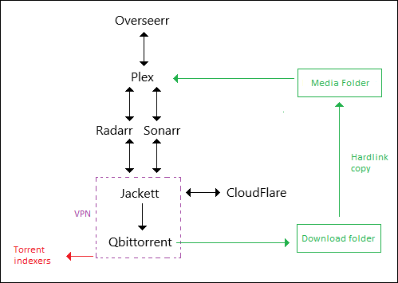

# plex-media-server
Plex Media Server Stack hosted on a local Ubuntu Server 22.04 LTS

## Stack
- [Overseerr](https://github.com/linuxserver/docker-overseerr)

- [Plex Media Server](https://github.com/plexinc/pms-docker)

- [Sonarr](https://github.com/linuxserver/docker-sonarr)

- [Radarr](https://github.com/linuxserver/docker-radarr)

- [Jackett](https://github.com/linuxserver/docker-jackett)

- [Flaresolverr](https://github.com/FlareSolverr/FlareSolverr)

- [Qbittorrent](https://github.com/linuxserver/docker-qbittorrent/releases)

- [Vpn](https://github.com/qdm12/gluetun)

## Architecture

